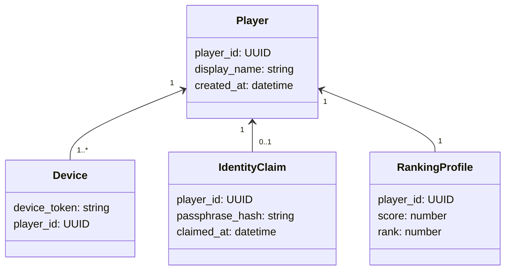
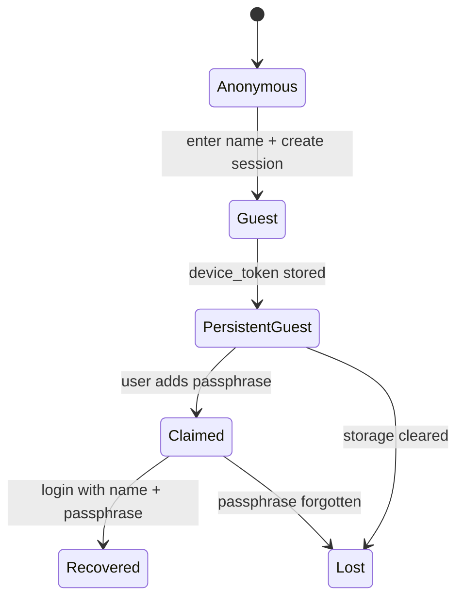

# 🧩 easy-login

*A lightweight identity service for browser-first games and simple applications.*

---

## 1. Purpose

**easy-login** is a minimal identity layer designed to support:

* instant access (no friction)
* persistent identity (without full auth)
* optional ownership (without OAuth)

It is built for:

* browser-based games (e.g., Living Circles, agar.io-like)
* lightweight apps
* prototypes evolving into real systems

---

## 2. Design Philosophy

Aligned with your broader system thinking:

* **Continuity over friction**
* **Identity is optional, not required**
* **Ownership is progressive, not upfront**
* **System should tolerate loss, but allow recovery**

This mirrors your longevity principle:

> Systems should remain usable without requiring peak behavior
> (no forced login, no mandatory identity)

---

## 3. Core Layers

## Layer 1 — Instant Identity (Guest)

* Player enters a **display name**
* System generates:

  * `player_id` (UUID)
  * `device_token` (stored locally)

### Characteristics

* no login
* no uniqueness guarantee
* identity persists on same browser
* ranking tied to internal `player_id`

### Example

```txt
Display Name: henrique
Internal ID: 8f3a-...
```

---

## Layer 2 — Claimed Identity (Passphrase)

* Player can **claim ownership**
* System generates or accepts:

  * `recovery_passphrase`

### Characteristics

* enables identity recovery
* allows name reservation
* portable across devices
* still no email / OAuth

### Example

```txt
Name: henrique
Passphrase: moon-river-42
```

---

## 4. Identity Model

Three distinct concepts:

| Concept                 | Description                   |
| ----------------------- | ----------------------------- |
| **Display Identity**    | What other players see        |
| **Persistent Identity** | Internal player record        |
| **Ownership Proof**     | Mechanism to reclaim identity |

---

## 5. Options Overview

### 1. Display Name Only

**Pros**

* zero friction
* instant play

**Cons**

* no persistence
* no ownership
* unusable for ranking

---

### 2. Session-Based Identity

**Pros**

* simple
* works for casual play

**Cons**

* lost on refresh/device change
* weak persistence

---

### 3. Persistent Guest (device token)

**Pros**

* no login
* persistent on same browser
* ideal default

**Cons**

* tied to device
* fragile if storage is cleared

---

### 4. Passphrase Claim (recommended)

**Pros**

* no email
* portable
* simple recovery
* enables ranking integrity

**Cons**

* user must store passphrase
* possible loss

---

### 5. Magic Link (future option)

**Pros**

* stronger identity
* cross-device

**Cons**

* introduces friction
* requires email infra

---

### 6. OAuth (explicitly avoided for now)

**Pros**

* strong identity

**Cons**

* heavy
* breaks instant-play experience

---

## 6. Comparison to Agar.io

### Similarities

* instant play without login
* display name input
* session-based identity

### Differences (easy-login improvements)

| Feature             | Agar.io | easy-login     |
| ------------------- | ------- | -------------- |
| Persistent identity | ❌       | ✅              |
| Ranking continuity  | ❌       | ✅              |
| Identity recovery   | ❌       | ✅ (passphrase) |
| Upgrade path        | ❌       | ✅              |

---

## 7. Domain Model



---

## 8. State Transitions

### Identity Lifecycle



---

## 9. Flow Examples

### First Visit

```txt
User opens game
→ enters name
→ system creates player_id + device_token
→ game starts immediately
```

---

### Returning User (same device)

```txt
User opens game
→ device_token found
→ player restored automatically
```

---

### Claim Identity

```txt
User chooses "protect account"
→ system generates passphrase
→ player stores it
→ identity becomes portable
```

---

### Recovery (new device)

```txt
User enters:
- name
- passphrase

→ system restores player_id
→ ranking preserved
```

---

## 10. Minimal API Sketch

### Create / Get Player

```http
POST /players
→ returns player_id + device_token
```

---

### Resume Session

```http
GET /players/session
→ uses device_token
```

---

### Claim Identity

```http
POST /players/claim
→ input: player_id
→ output: passphrase
```

---

### Recover Identity

```http
POST /players/recover
→ input: name + passphrase
→ returns player_id + new device_token
```

---

## 11. Design Tradeoffs

### What we gain

* extremely low friction
* progressive identity
* suitable for games
* simple backend

### What we accept

* weaker security than full auth
* possible identity loss (by design)
* user responsibility for passphrase

---

## 12. Guiding Principle

> Identity should not block participation.
> Ownership should emerge only when needed.

---

## 13. Recommended Default for Living Circles

* start with **Persistent Guest**
* enable **Passphrase Claim**
* require claim only for:

  * ranked mode
  * leaderboard persistence
  * cross-device play

---

## 14. Future Extensions

* email magic link
* OAuth providers
* public/private profiles
* anti-cheat identity strengthening
* multi-device sync
